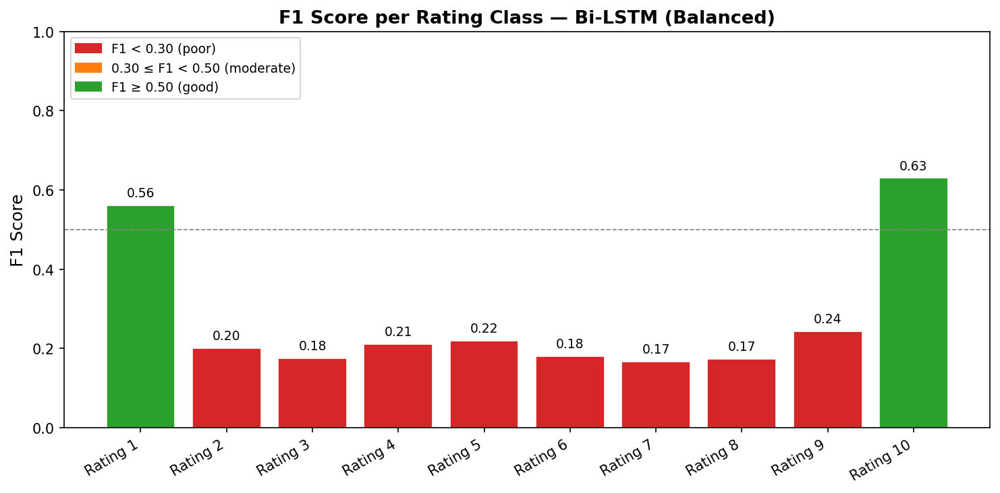
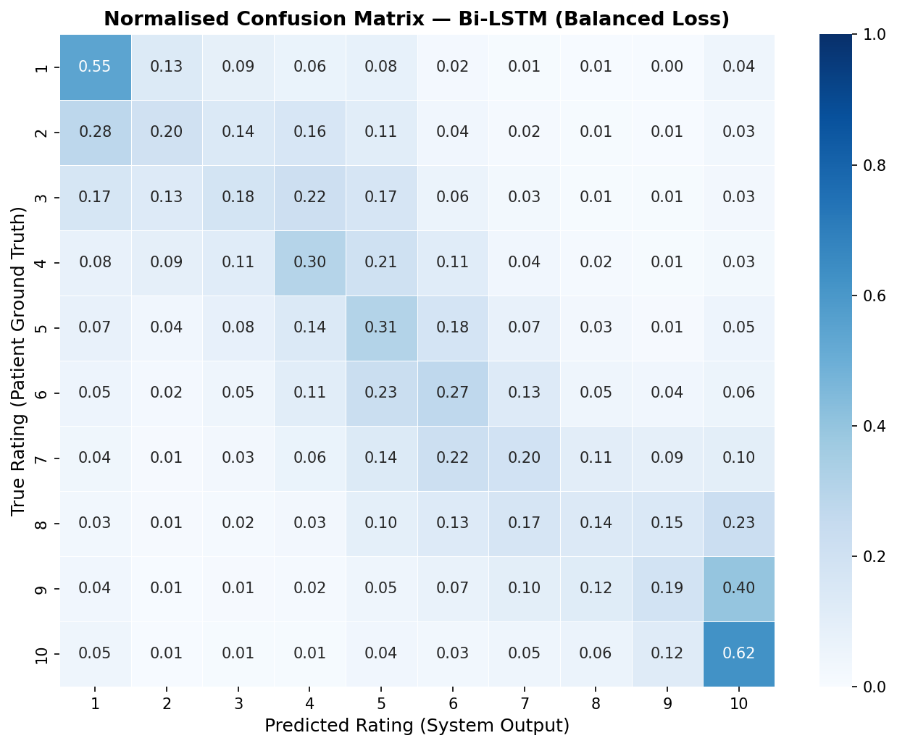
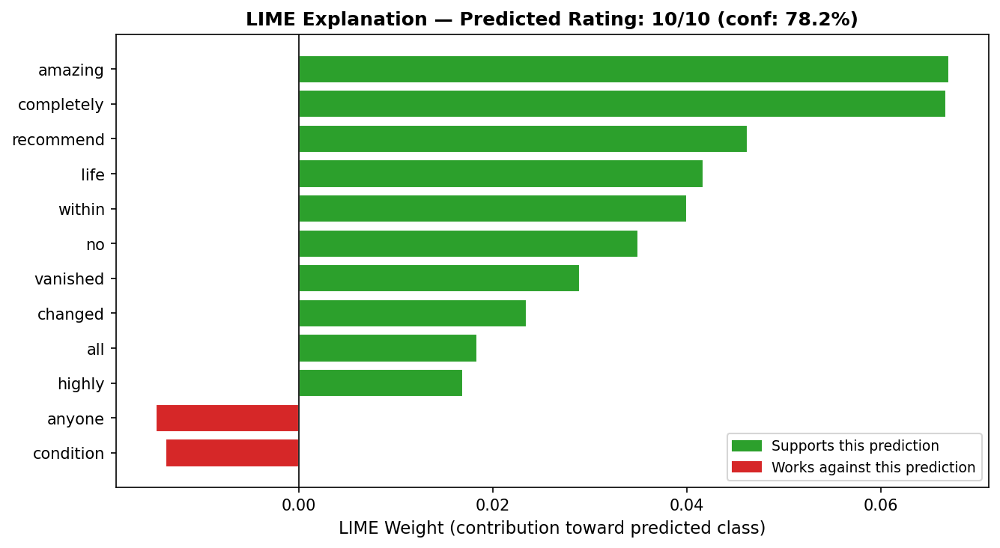
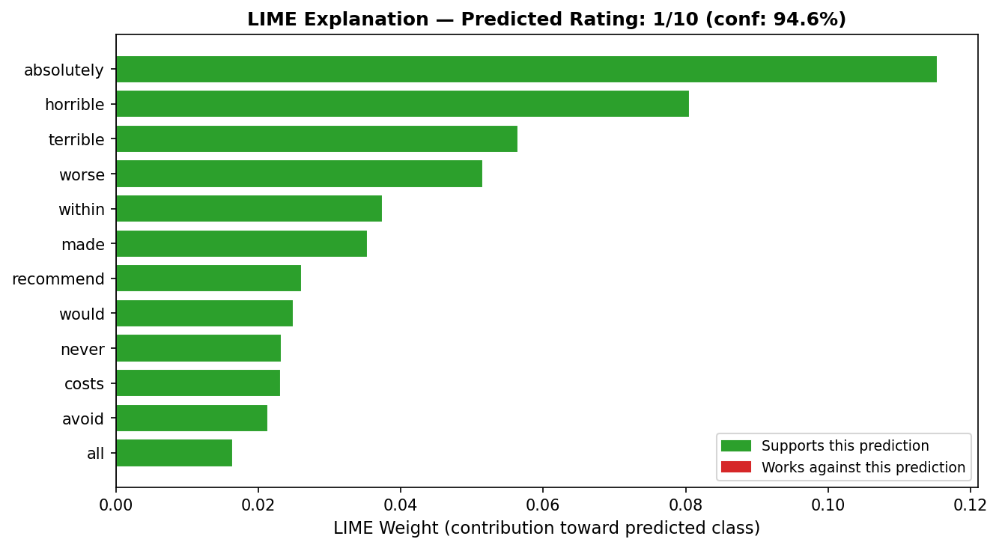
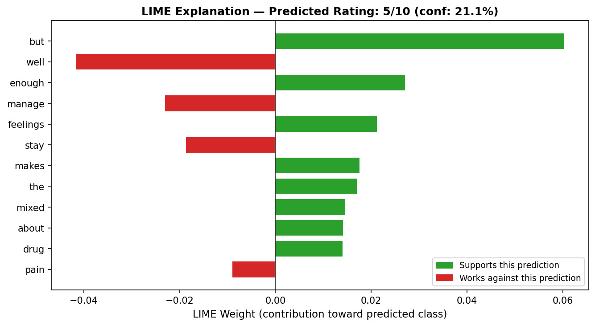
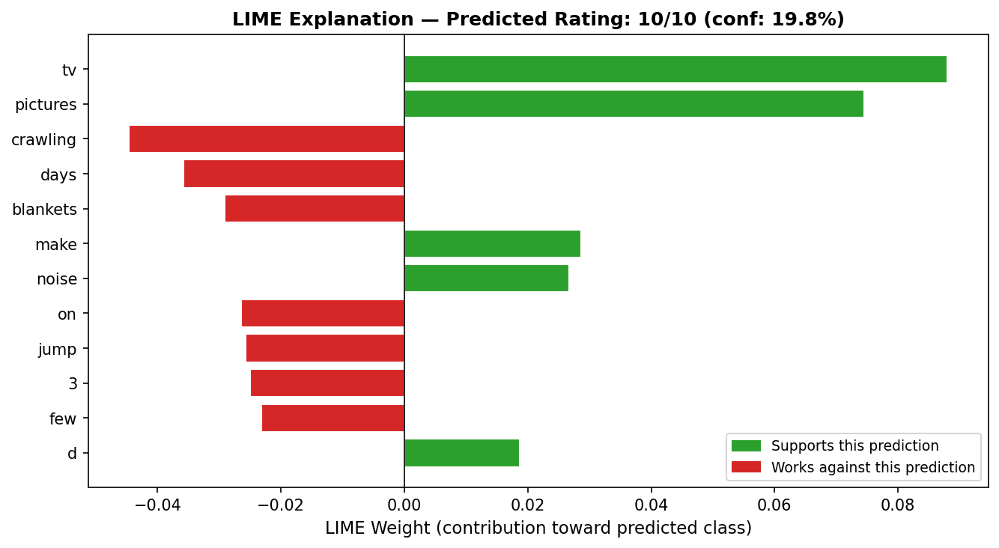
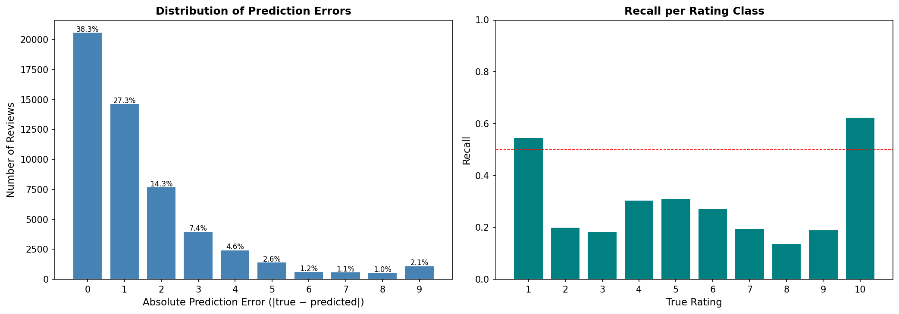
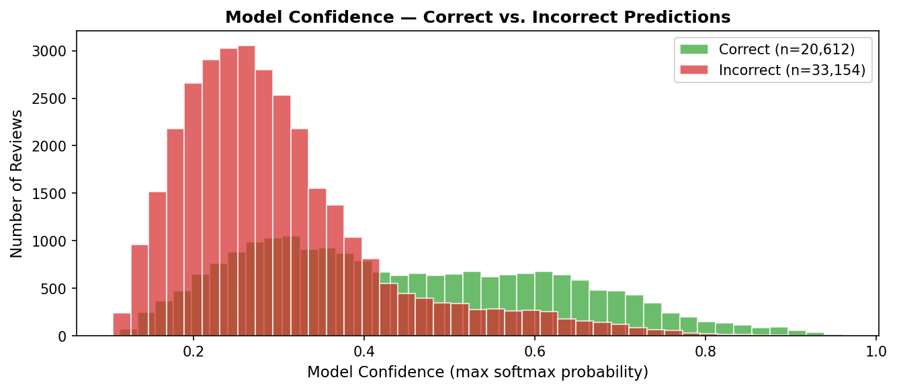

# 💊 Drug Review Rating Prediction

> A end-to-end deep learning pipeline that predicts patient drug ratings from review text, with LIME-based interpretability and LLM-powered summarization.


---

## 📌 Overview

Patients on platforms like [Drugs.com](https://www.drugs.com) leave detailed reviews about their medication experience, each paired with a 1–10 star satisfaction rating. This project builds a **Bidirectional LSTM** model that reads those reviews and predicts the rating — a challenging 10-class ordinal text classification problem.

The project also includes a **Generative AI component**: a local LLM (Llama 3.2 via Ollama) generates concise summaries and binary sentiment labels for each review using two distinct prompt engineering strategies.

**Dataset:** [UCI Drug Review Dataset](https://www.kaggle.com/datasets/jessicali9530/kuc-hackathon-winter-2018) — 215,063 patient reviews from Drugs.com  
**Reference paper:** [Gräßer et al. (2018) — Aspect-Based Sentiment Analysis of Drug Reviews](https://opus.bibliothek.uni-augsburg.de/opus4/frontdoor/deliver/index/docId/99635/file/99635.pdf)

---

## 🏆 Results at a Glance

| Metric | Value |
|--------|-------|
| Overall Accuracy (10-class) | **38.3%** |
| Within 1 Star | **65.6%** |
| Within 2 Stars | **79.9%** |
| Mean Absolute Error | **~1.51 stars** |
| Rating 1 F1 Score | **0.56** |
| Rating 10 F1 Score | **0.63** |
| Macro F1 (all classes) | **~0.28** |

> **Context:** The original paper (Gräßer et al.) achieved 75% accuracy on a simplified 3-class version of this problem. This model solves the harder 10-class variant, where ~80% of predictions land within 2 stars of the true rating.

---

## 🗂️ Project Structure

```
drug-review-rating-prediction/
│
├── notebooks/
│   ├── 01_EDA.ipynb                  # Exploratory data analysis
│   ├── 02_preprocessing.ipynb        # Text cleaning, tokenization, vocabulary
│   ├── 03_Training.ipynb             # Bi-LSTM training (initial + balanced)
│   ├── 04_Inference.ipynb            # Custom review prediction pipeline
│   ├── 05_generative_ai.ipynb        # LLM summarization + sentiment (2 strategies)
│   └── 06_interpretability.ipynb     # LIME analysis, error analysis, confidence
│
├── dataset/
│   ├── archive.zip                   # Raw dataset (drugsComTrain_raw.csv + Test)
│   └── processed/
│       └── processed_data.npz        # Tokenized arrays (generated by notebook 02)
│
├── models/
│   ├── bidi_lstm_balanced_model.keras # Final production model (generated by notebook 03)
│   └── vectorizer_vocabulary.json    # Saved vocabulary (generated by notebook 02)
│
├── outputs/
│   ├── alternative_a_zero_shot.xlsx  # GenAI output — Zero-Shot strategy
│   ├── alternative_b_few_shot.xlsx   # GenAI output — Few-Shot strategy
│   └── figures/                      # All plots (generated by notebook 06)
│       ├── f1_per_class.png
│       ├── confusion_matrix_normalised.png
│       ├── lime_positive_review.png
│       ├── lime_negative_review.png
│       ├── lime_mixed_review.png
│       ├── lime_error_case.png
│       ├── error_analysis.png
│       └── confidence_distribution.png
│
└── README.md
```

---

## 🔁 Pipeline

The project runs as a sequential 6-notebook pipeline. Each notebook saves its outputs to disk so subsequent steps can run independently.

```
Raw Dataset (archive.zip)
        │
        ▼
  01_EDA.ipynb
  → Understand rating distribution & review lengths
  → Determine MAX_LEN = 150 (90th percentile of word counts)
        │
        ▼
  02_preprocessing.ipynb
  → HTML unescape + lowercase + strip
  → TextVectorization (VOCAB_SIZE=10,000, MAX_LEN=150)
  → Save: processed_data.npz + vectorizer_vocabulary.json
        │
        ▼
  03_Training.ipynb
  → Build Bidirectional LSTM (Embedding → BiLSTM → Dropout → Dense)
  → Train initial model → identify class imbalance problem
  → Retrain with class weights → save: bidi_lstm_balanced_model.keras
        │
        ▼
  04_Inference.ipynb                   05_generative_ai.ipynb
  → Load model + vocabulary            → Local LLM (Ollama / Llama 3.2 3B)
  → Predict on custom reviews          → Two prompt strategies: Zero-Shot & Few-Shot
                                       → Export: alternative_a/b .xlsx
        │
        ▼
  06_interpretability.ipynb
  → LIME word-level explanations
  → Error analysis + confidence calibration
  → Save all figures to outputs/figures/
```

---

## 📊 Key Visualizations

### Rating Distribution & Class Imbalance

The dataset is strongly skewed — Rating 10 accounts for 31.6% of all reviews while Rating 4 is the rarest class at 3.1%. This imbalance directly motivates the class weight balancing strategy in training.

> *Figure generated by notebook 01 — add your image here:*
> ``

---

### F1 Score per Rating Class



The model performs well only at the extremes (Rating 1: F1=0.56, Rating 10: F1=0.63). Middle ratings (2–9) have F1 scores between 0.17–0.24, reflecting the genuine linguistic ambiguity of moderate-sentiment reviews.

---

### Normalised Confusion Matrix



Each row sums to 1.0 — the diagonal represents recall per class. The model's probability mass shifts toward Rating 5 for ambiguous middle-range reviews, and 40% of true Rating 9 reviews are predicted as Rating 10.

---

### LIME Interpretability — What the Model Actually Learned

LIME explains individual predictions by identifying which words drove each decision. These charts confirm the model has learned genuine medical and sentiment vocabulary.

| Positive Review (Rating 10, conf: 78.2%) | Negative Review (Rating 1, conf: 94.6%) |
|---|---|
|  |  |

| Mixed Review (Rating 5, conf: 21.1%) | Error Case (Wrong prediction) |
|---|---|
|  |  |

**Key finding:** Strong-sentiment reviews are explained by clinically relevant vocabulary ("amazing", "vanished", "horrible", "avoid"). The model's failures occur in the middle rating range where language is inherently ambiguous — a fundamental challenge not specific to this architecture.

---

### Error Distribution & Confidence



38.3% of predictions are exact; 65.6% are within 1 star. The recall chart (right) confirms that only Ratings 1 and 10 exceed the 0.50 threshold.



Correct predictions (green) cluster toward higher confidence values. The overlap between correct and incorrect distributions indicates some overconfidence on wrong predictions — a known limitation of uncalibrated neural networks.

---

## 🤖 Generative AI Task

For each review in the evaluation set, a local LLM generates a concise summary (≤10 words) and a binary sentiment label. Two prompting strategies are compared.

### Strategy A — Zero-Shot
A single prompt with role assignment and output format instructions. No examples provided.

```python
prompt = f"""
You are analyzing a patient medical review. Your task is to extract
an ultra-short summary and a binary sentiment.

Review: "{review}"

Return ONLY a valid JSON with:
- "summary": maximum 10 words
- "sentiment": "positive" or "negative"
"""
```

### Strategy B — Few-Shot with System Instruction *(recommended)*
Combines three prompt engineering techniques: a system-level persona, numbered hard constraints, and two worked examples in XML-tagged blocks.

```python
system = """
You are a specialized clinical data extraction assistant.
1. Summary must be 10 words or fewer.
2. Sentiment must be exactly 'positive' or 'negative'.
3. Respond ONLY with valid JSON. No markdown, no backticks.
"""

prompt = f"""
<examples>
Review: "This medication changed my life completely. No side effects."
Output: {{"summary": "Life-changing, no side effects.", "sentiment": "positive"}}

Review: "Horrible nausea and headaches immediately. Avoid at all costs."
Output: {{"summary": "Severe nausea and headaches, avoid entirely.", "sentiment": "negative"}}
</examples>

<target_review>{review}</target_review>
Output JSON:
"""
```

**Strategy B produces more reliable JSON output and better adherence to the 10-word limit.** The worked examples demonstrate the exact format the model should follow, which is especially important for smaller local models.

### Output Format

Both strategies export Excel files with the following fields:

| Field | Source |
|-------|--------|
| `drugName` | Original dataset |
| `condition` | Original dataset |
| `review` | Original dataset |
| `rating` | Ground truth (1–10) |
| `predicted_rating` | Bi-LSTM model |
| `generated_summary` | LLM — max 10 words |
| `identified_sentiment` | LLM — "positive" or "negative" |

---

## ⚙️ Setup & Installation

### 1. Clone the repository
```bash
git clone https://github.com/Hana-esf/drug-review-rating-prediction.git
cd drug-review-rating-prediction
```

### 2. Create and activate a virtual environment
```bash
python3 -m venv venv
source venv/bin/activate        # macOS / Linux
venv\Scripts\activate           # Windows
```

### 3. Install dependencies
```bash
pip install tensorflow numpy==1.26.4 pandas scikit-learn lime matplotlib seaborn openpyxl jupyter
```

> **Note on NumPy:** TensorFlow 2.16.x requires `numpy<2.0`. Pin to `numpy==1.26.4` to avoid import errors.

### 4. Download the dataset
Download `archive.zip` from [Kaggle](https://www.kaggle.com/datasets/jessicali9530/kuc-hackathon-winter-2018) and place it in the `dataset/` folder.

### 5. (Optional) Set up Ollama for the Generative AI notebook
```bash
# Install Ollama from https://ollama.com
ollama pull llama3.2:3b
ollama serve
```

---

## ▶️ Running the Pipeline

Run the notebooks **in order**. Each one saves its outputs to disk for the next step.

```bash
jupyter notebook
```

| Step | Notebook | Runtime (approx.) |
|------|----------|-------------------|
| 1 | `01_EDA.ipynb` | ~1 min |
| 2 | `02_preprocessing.ipynb` | ~3 min |
| 3 | `03_Training.ipynb` | ~30–60 min (CPU) |
| 4 | `04_Inference.ipynb` | ~1 min |
| 5 | `05_generative_ai.ipynb` | ~30 min (100 reviews, CPU) |
| 6 | `06_interpretability.ipynb` | ~10 min |

> After running notebook 06, all figures are saved to `outputs/figures/` and will render in this README automatically.

---

## 🧠 Model Architecture

```
Input: integer sequence of length 150
    │
    ▼
Embedding(10000 → 64 dimensions)
    │
    ▼
Bidirectional LSTM(64 units)   ← reads sequence both forward and backward
    │
    ▼
Dropout(0.50)                  ← regularization to prevent overfitting
    │
    ▼
Dense(10, softmax)             ← probability distribution over ratings 1–10
    │
    ▼
Output: predicted rating (1–10)
```

**Loss function:** Sparse categorical cross-entropy  
**Optimizer:** Adam (lr=0.001)  
**Class imbalance fix:** `compute_class_weight('balanced')` from scikit-learn — rare ratings are up-weighted during training so the model cannot take the shortcut of always predicting Rating 10.

---

## 📄 References

- Gräßer, F., Kallumadi, S., Malberg, H., & Zaunseder, S. (2018). [Aspect-Based Sentiment Analysis of Drug Reviews Applying Cross-Domain and Cross-Data Learning.](https://opus.bibliothek.uni-augsburg.de/opus4/frontdoor/deliver/index/docId/99635/file/99635.pdf) *Proceedings of DH2018.*
- UCI Drug Review Dataset: [Kaggle](https://www.kaggle.com/datasets/jessicali9530/kuc-hackathon-winter-2018)
- Ribeiro, M. T., Singh, S., & Guestrin, C. (2016). ["Why Should I Trust You?": Explaining the Predictions of Any Classifier.](https://arxiv.org/abs/1602.04938) *KDD 2016.*

---

## 👤 Author

**Hana Esfandiar**  
Co-founder, [AI Agents Simplified](https://aiagentssimplified.substack.com)  
Incoming MSc Computer Science — Dalhousie University  
[GitHub](https://github.com/Hana-esf) · [LinkedIn](https://linkedin.com/in/hana-esfandiar)

---

*This project was completed as a technical assessment task. All code is original and the pipeline is fully reproducible from the raw dataset.*
